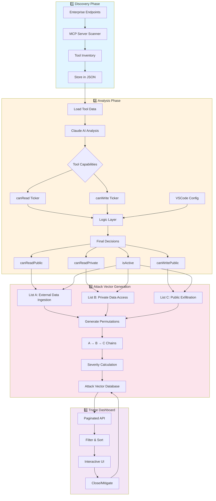
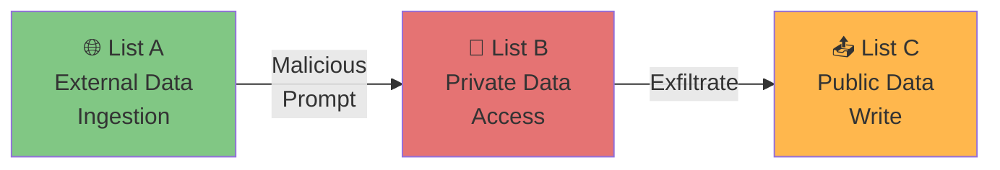

# 🛡️ MCP Security Analyzer

**Automated security analysis and attack vector detection for Model Context Protocol (MCP) servers**

[](https://opensource.org/licenses/MIT)
[](https://www.typescriptlang.org/)
[](https://nextjs.org/)

## 📖 Overview

MCP Security Analyzer is an automated tool for analyzing security risks in Model Context Protocol (MCP) server deployments. It discovers MCP servers across your enterprise, analyzes tool capabilities using LLMs, and identifies potential attack vectors through prompt injection.

### 🎯 Key Features

- **🔍 Automated Discovery**: Scans endpoints to discover MCP servers and their tools
- **🤖 LLM-Powered Analysis**: Uses Claude AI to analyze tool capabilities (read/write permissions)
- **⚡ Attack Vector Detection**: Automatically identifies 3-step attack chains
- **📊 Risk Prioritization**: Severity scoring based on endpoint/server proximity
- **🎨 Interactive Dashboard**: Real-time visualization and triage interface
- **⚙️ VSCode Integration**: Reads tool enabled/disabled status from VSCode workspace

---

## 🏗️ Architecture



---

## 🎯 Attack Vector Model

The analyzer detects **3-step prompt injection attack chains**:



### Attack Chain Example

1. **Step A** (External Ingestion): Tool reads from untrusted source (e.g., `github/get_file_contents`)
2. **Step B** (Private Access): Malicious prompt triggers private data access (e.g., `filesystem/read_file`)
3. **Step C** (Exfiltration): Data is sent to public destination (e.g., `slack/send_message`)

### Severity Levels

| Severity | Condition | Risk Level | Example |
|----------|-----------|------------|---------|
| 🔴 **High** | Same endpoint + same server | Most direct attack path | All tools on single GitHub Copilot instance |
| 🟡 **Medium** | Same endpoint + different servers | Cross-server coordination needed | GitHub + Slack tools on same machine |
| 🟢 **Low** | Different endpoints | Requires lateral movement | Tools on separate machines/networks |

---

## 🚀 Quick Start

### Prerequisites

- Node.js 18+
- npm or yarn
- Anthropic API key (for Claude AI analysis)
- VSCode with MCP servers configured (optional)

### Installation

```bash
# Clone the repository
git clone https://github.com/AshwinRamachandran2002/Agent_Red_Team.git
cd Agent_Red_Team/router

# Install dependencies
npm install

# Set up environment variables
cp .env.example .env
# Edit .env and add your ANTHROPIC_API_KEY

# Run the development server
npm run dev
```

Visit `http://localhost:3000` to access the dashboard.

---

## 📁 Project Structure

```
router/
├── app/                          # Next.js app directory
│   ├── api/                      # API routes
│   │   ├── servers/              # MCP server discovery API
│   │   ├── analysis/             # Tool analysis APIs
│   │   │   ├── generate/         # LLM analysis endpoint
│   │   │   ├── decisions/        # Store analysis results
│   │   │   └── vscode-disabled/  # VSCode integration
│   │   └── attack-vectors/       # Attack vector generation API
│   ├── discovery/                # Discovery UI
│   ├── analysis/                 # Analysis UI
│   ├── attack-triage/            # Attack vector triage UI
│   └── page.tsx                  # Home page
├── lib/                          # Core logic
│   ├── attack-vector-generator.ts    # Attack chain generation
│   ├── analysis-logic.ts             # Decision computation logic
│   └── vscode-tools-reader.ts        # VSCode workspace reader
├── scripts/
│   └── generate-attack-vectors.ts    # Offline generation script
├── data/
│   ├── discovered/               # Discovered MCP servers (JSON)
│   └── analysis/                 # Analysis results and vectors
└── enterprise_data/
    └── enterprise_inventory.json # Endpoint inventory
```

---

## 📊 Usage Workflow

### 1. Discovery Phase

Navigate to **Discovery** page to scan your enterprise endpoints:

```bash
# The scanner will:
# - Read enterprise_inventory.json
# - Discover MCP servers on each endpoint
# - Extract tool definitions
# - Store results in data/discovered/
```

**Output**: `data/discovered/{server_name}_tools.json` for each MCP server

### 2. Analysis Phase

Navigate to **Analysis** page to analyze tools:

1. **View Tools**: See all discovered tools with filter options
2. **Generate Analysis**: Click "Regenerate All" or analyze individual tools
3. **LLM Analysis**: Claude AI determines:
   - `canRead`: Tool can read/fetch data
   - `canWrite`: Tool can write/modify data
4. **Logic Layer**: Computes final decisions:
   - `isActive`: From VSCode workspace (enabled/disabled)
   - `canReadPrivate`: Can access private/sensitive data
   - `canReadPublic`: Can read from external/untrusted sources
   - `canWritePublic`: Can write to public destinations

**Output**: `data/analysis/tool_decisions.json`

### 3. Attack Vector Generation

```bash
# Generate attack vectors offline (faster)
npm run generate-vectors

# Or use the API (with pagination)
curl http://localhost:3000/api/attack-vectors?page=1&pageSize=50
```

**Output**: `data/analysis/attack_vectors.json` (24,000+ vectors)

### 4. Triage & Mitigation

Navigate to **Attack Triage** page:

1. **Filter vectors** by severity, status, or endpoint
2. **View details** of each attack chain
3. **Generate mitigation steps** using LLM
4. **Close vectors** after implementing fixes

---

## 🔧 Configuration

### Enterprise Inventory

Edit `enterprise_data/enterprise_inventory.json`:

```json
{
  "endpoints": [
    {
      "endpoint": "endpoint_MachineName",
      "repos": ["owner/repo1", "owner/repo2"]
    }
  ]
}
```

### VSCode Integration

The analyzer automatically reads VSCode workspace settings from:
```
~/Library/Application Support/Code/User/workspaceStorage/*/state.vscdb
```

It detects:
- Disabled MCP servers (`disabledToolSets`)
- Disabled individual tools (`disabledTools`)

### Environment Variables

```bash
# .env
ANTHROPIC_API_KEY=your_api_key_here
NEXT_PUBLIC_APP_URL=http://localhost:3000
```

---

## 🧪 Technical Details

### Two-Tier Analysis Architecture

**Why?** Separates basic capability detection (LLM) from security decisions (logic layer)

1. **LLM Layer** (Simple, fast):
   - Input: Tool name, description, arguments
   - Output: `canRead`, `canWrite` booleans
   - Provider: Claude 3.5 Sonnet

2. **Logic Layer** (Configurable, auditable):
   - Combines LLM tickers with detection functions
   - Currently uses conservative defaults (assume true)
   - Future: Sophisticated detection algorithms

### Attack Vector Permutations

For `n` tools categorized into 3 lists:
- **List A**: Tools that can read public data
- **List B**: Tools that can read private data
- **List C**: Tools that can write to public destinations

Total vectors = `|A| × |B| × |C|`

Example: 36 × 36 × 19 = **24,624 attack vectors**

### Performance Optimizations

- **Server-side pagination**: API returns 50 vectors/page
- **Cached generation**: Vectors cached in JSON file
- **Offline generation script**: Pre-generate all vectors
- **Parallel batch loading**: Frontend loads data efficiently

---

## 🔐 Security Considerations

### Defensive Security Tool

⚠️ **This tool is designed for DEFENSIVE security purposes only**:
- Analyze your own MCP deployments
- Identify and mitigate security risks
- Improve security posture

❌ **Do NOT use for**:
- Attacking systems you don't own
- Credential harvesting
- Malicious prompt injection

### Data Privacy

- All analysis runs **locally** on your machine
- API keys stored in `.env` (never committed)
- Tool definitions stored in local `data/` directory
- No data sent to external services (except Claude API for analysis)

---

## 🛠️ Development

### Run Development Server

```bash
npm run dev
```

### Generate Attack Vectors

```bash
npm run generate-vectors
# or
npx tsx scripts/generate-attack-vectors.ts
```

### Build for Production

```bash
npm run build
npm run start
```

### Key Technologies

- **Frontend**: Next.js 14, React, TypeScript
- **UI Components**: shadcn/ui, Tailwind CSS
- **AI**: Anthropic Claude API
- **Database**: JSON files (future: SQLite/PostgreSQL)
- **Visualization**: Mermaid diagrams

---

## 📈 Roadmap

- [ ] Implement sophisticated detection algorithms for private/public data access
- [ ] Add support for more LLM providers (OpenAI, local models)
- [ ] Real-time monitoring and alerting
- [ ] Integration with SIEM systems
- [ ] Multi-user collaboration features
- [ ] Automated fix generation
- [ ] CI/CD pipeline integration
- [ ] Docker containerization

---

## 🤝 Contributing

Contributions are welcome! Please feel free to submit a Pull Request.

1. Fork the repository
2. Create your feature branch (`git checkout -b feature/AmazingFeature`)
3. Commit your changes (`git commit -m 'Add some AmazingFeature'`)
4. Push to the branch (`git push origin feature/AmazingFeature`)
5. Open a Pull Request

---

## 📄 License

This project is licensed under the MIT License - see the [LICENSE](LICENSE) file for details.

---

## 🙏 Acknowledgments

- [Model Context Protocol (MCP)](https://modelcontextprotocol.io/) by Anthropic
- [Claude AI](https://www.anthropic.com/claude) for LLM-powered analysis
- [Next.js](https://nextjs.org/) and [Vercel](https://vercel.com/) for the framework
- [shadcn/ui](https://ui.shadcn.com/) for beautiful UI components

---

## 📧 Contact

**Ashwin Ramachandran**
- GitHub: [@AshwinRamachandran2002](https://github.com/AshwinRamachandran2002)
- Project Link: [https://github.com/AshwinRamachandran2002/Agent_Red_Team](https://github.com/AshwinRamachandran2002/Agent_Red_Team)

---

## 🌟 Star History

[](https://star-history.com/#AshwinRamachandran2002/Agent_Red_Team&Date)

---

**Made with ❤️ for the security community**
